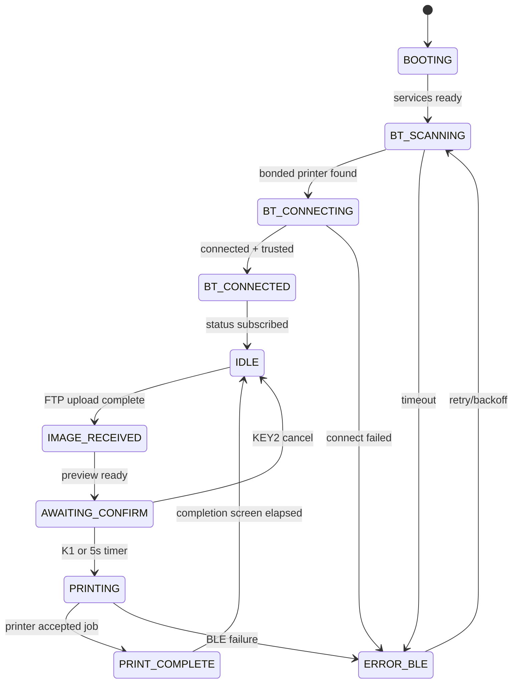

# Architecture

## System Boundary

InstantLink Bridge is a single-device bridge running on Raspberry Pi Zero 2 W. For v1, the Sony camera is treated as a hotspot-first Wi-Fi FTP client, with optional Same Wi-Fi FTP. The Instax printer is treated as a bonded BLE peripheral. The Pi owns all orchestration, image processing, UI, power management, and provisioning. The USB gadget network is admin/SSH/diagnostics only, not a supported camera wired mode.

## Data Flow

```text
User in camera playback
  |
  | C1 mapped to "FTP Trans. (This Img.)"
  v
Sony a7C II / ILCE-7CM2
  |
  | Bridge hotspot Wi-Fi, or optional same-network peer Wi-Fi
  v
Pi Zero 2 W network receive paths
  |
  | AP mode, wlan0 static 192.168.8.1/24
  | optional existing Wi-Fi, router-reserved address
  | USB gadget, usb0 static 192.168.7.1/24 for admin/SSH/diagnostics
  v
pyftpdlib FTP server on 0.0.0.0:21
  |
  | on_file_received(path)
  v
asyncio.Queue[ImageJob] maxsize=100
  |
  | run_in_executor for CPU-bound Pillow work
  v
Pillow / pillow-heif / rawpy image pipeline
  |
  | JPEG fast path: Image.draft("RGB", (1600, 1600))
  | HIF/HEIF: heif-thumbnailer -s 1600, pillow-heif fallback
  | Sony RAW/ARW: embedded preview first, half-size rawpy fallback
  | ImageOps.exif_transpose
  | ImageOps.fit(model dimensions, Image.Resampling.LANCZOS)
  | JPEG q100, 4:2:0, model max-size enforcement
  v
InstantLink Rust FFI backend on BlueZ
  |
  | InstantLink core BLE transport + printer protocol
  v
Fujifilm Instax Mini / Mini Link 3 / Square / Wide Link
```

## State Machine



The 10 primary states are `BOOTING`, `BT_SCANNING`, `BT_CONNECTING`, `BT_CONNECTED`, `IDLE`, `IMAGE_RECEIVED`, `AWAITING_CONFIRM`, `PRINTING`, `PRINT_COMPLETE`, and `ERROR_BLE`. `SETTINGS` is a UI overlay/menu reachable from normal status screens; it does not stop FTP receive or BLE status polling. `LOW_BATTERY` is a global overlay/guard because it can occur over any state. USB gadget attach/loss is diagnostics/admin status only and must not gate camera readiness in v1.

Runtime settings that are safe to change from the 240x240 UI are persisted to
`/etc/InstantLinkBridge/config.toml`: printer model override, image fit, JPEG quality, auto-print
mode/delay, and BLE keepalive interval. Wi-Fi mode switching is a side-effecting
action routed through the root-owned `/usr/local/sbin/instantlink-bridge-wifi-mode` helper.

## Asyncio Task Topology

The runtime should be one Python process with named tasks:

| Task | Responsibility | Communication |
| --- | --- | --- |
| `orchestrator` | Owns state machine, event routing, queue draining, shutdown | Reads `event_queue`, writes `state_changed` |
| `ftp_server` | Runs pyftpdlib and emits image-received events | Writes `image_queue` via `asyncio.run_coroutine_threadsafe` |
| `image_worker` | Runs Pillow preparation in executor | Reads `image_queue`, writes `event_queue` |
| `ble_client` | Scans, connects, sends images, subscribes status | Reads commands from orchestrator, writes printer events |
| `ui_render` | Event-driven luma.lcd rendering at 1-2 fps max | Reads state snapshots and `state_changed` |
| `ui_input` | gpiozero joystick/buttons, long-press KEY3 | Writes button/input events |
| `power_monitor` | X306/no-telemetry power backend, optional PiSugar polling, idle timing | Writes battery/idle/shutdown events |
| `watchdog` | sd_notify READY/WATCHDOG heartbeat | Reads health events, emits degraded status |

## Power Management Foundation

Power management is wired into the main app controller through `PowerMonitor`.

- `X306BatteryClient` is the default backend. The SupTronics/Geekworm X306 has charging, UPS
  power-path switching, LEDs, and a hardware button, but no Linux-readable fuel gauge. It reports
  unavailable telemetry truthfully instead of inventing percentage or charging state.
- `PiSugarClient` remains available only when `[power].backend = "pisugar"` is configured. It
  talks to `/tmp/pisugar-server.sock` and parses `battery`, `battery_v`, `battery_charging`,
  `battery_power_plugged`, `battery_allow_charging`, `model`, `firmware_version`, and `rtc_time`.
- `PowerMonitor` polls a `BatteryClient` every 30 s by default, evaluates warning and safe-shutdown
  thresholds at 20% and 10% only when telemetry exists, and emits typed `PowerEvent` values for
  battery updates, alert changes, idle changes, and shutdown requests.
- Shutdown is an injected callable wired by `app.py` to the provisioned
  `/usr/local/sbin/instantlink-bridge-poweroff` helper through a limited sudoers rule.
- The idle model is driven by activity events from GPIO, FTP receive, camera Wi-Fi changes, settings
  navigation, and print workflow milestones. Stages are `active`, `dim` at 30 s, `screen_off` at
  90 s, and `deep_idle` at 5 min. Automatic `poweroff` at 10 min is available but defaults off on
  X306 because unexpected hardware poweroff looks like a crash during normal testing. Any activity
  resets the timer and wakes the stage back to `active`.

## Inter-Task Primitives

- `asyncio.Queue[ImageJob]` for completed FTP uploads, bounded to `maxsize=100` and drained one
  job at a time.
- `asyncio.Queue[BridgeEvent]` for state machine inputs.
- `asyncio.Event` for `state_changed`, `shutdown_requested`, and `ble_ready`.
- `loop.run_in_executor` for Pillow resize/encode work so BLE and UI timers do not stall.
- Typed structured events using `TypedDict` or dataclasses once implementation starts.

Example event shapes for future implementation:

```python
class ImageJob(TypedDict):
    source_path: str
    received_at_monotonic: float
    camera_ip: str

class BridgeEvent(TypedDict):
    type: str
    payload: dict[str, object]
    created_at_monotonic: float
```

These are architecture examples, not implemented code.

## Failure Domains

- USB gadget failures are diagnostics/admin issues and should not gate v1 camera readiness. Direct
  Sony USB-LAN via the Pi gadget is unsupported for v1 based on the 2026-05-22 Mac-proven
  cable/camera retest.
- BLE print-path failures should be handled by the InstantLink FFI backend first. The Python/Bleak
  path is retained only as a diagnostic fallback and may remove stale BlueZ device paths on
  `BleakDeviceNotFoundError`.
- The boot UI status path uses 1 s discovery windows while searching, keeps the BLE connection
  open after a successful status read, and polls status every 10 s by default as the printer
  keepalive.
- Image pipeline failures should reject corrupt or unsupported still images with a friendly UI error and should never poison the queue. JPEG and HIF/HEIF are first-class inputs; Sony RAW/ARW is best-effort through rawpy. Inputs may be as large as 100 MP, so every decoder path must reduce to a bounded working image before Instax fitting.
- Disk pressure should evict image cache older than 24 h and degrade to receive-disabled before corrupting active jobs.
