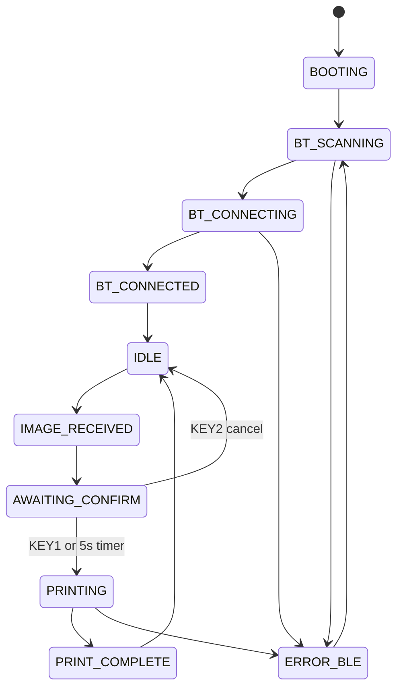

# UX Flows

Display: 240x240 LCD, event-driven render loop, 1-2 fps maximum unless an animation needs a short burst.

## Screen Templates

### Splash

```text
+----------------------+
|     InstantLink Bridge    |
|                      |
|   starting...        |
|                      |
|  battery icon  BT    |
+----------------------+
```

### Ready

```text
+----------------------+
| Ready                |
| Bridge Wi-Fi | Sq 8/10|
|   Ready              |
|   to print           |
| Waiting for upload   |
| Next photo in order  |
| KEY1 Settings KEY3 FTP|
+----------------------+
```

The screen only says `READY` / `Ready to print` when both ends are healthy: at least one FTP
receive path is visible and the selected printer has a current status read with film available.

Power status is global UI chrome, not a separate workflow. The current X306 battery case exposes
battery state through hardware LEDs only, so the LCD shows `Battery case` / `LED only` in System
settings rather than fake bridge battery percentage. It should not show the X306 SKU in the normal
title bar or imply that the UPS chassis is the bridge device name. If a telemetry-capable backend is
configured later, the normal status surfaces show bridge battery percentage and charging/input
state. At 20% battery, the UI should show a low-battery warning without blocking an active print. At
10% battery while not on external power, the UI should show a critical-battery shutdown message and
let the power monitor request safe shutdown through its injected shutdown callable.

If either side is not healthy, the same readiness surface uses `WAITING` and shows the validation
state and concise causes:

```text
+----------------------+
| Ready check          |
|       WAITING        |
|     Ready check      |
| FTP: no FTP Wi-Fi    |
| Printer ready 8/10   |
| Choose FTP Wi-Fi     |
| KEY1 Settings Hold K3|
+----------------------+
```

The renderer keeps these lines short for the 240x240 LCD. Common causes are `Choose FTP Wi-Fi`,
`Wait for printer status`, `No printer signal`, `Hold KEY3 to re-pair`, `Replace film
pack`, and `Find printer`.

### No Film

```text
+----------------------+
| Needs attention      |
|       NO FILM        |
|    No film left      |
| Type: Mini           |
| Replace film pack    |
| KEY1 Settings Hold K3|
+----------------------+
```

### Boot Printer Setup Prompt

Shown at boot when no `INSTAX-*` printer is selected.

```text
+----------------------+
| Printer setup        |
|   No printer selected|
| > Find printer       |
|   Status             |
| Up/Dn KEY1 Select    |
+----------------------+
```

### Preview

```text
+----------------------+
|  preview image area  |
|                      |
| Preview / Print in 5 |
| Crop: 4-way pan KEY3 |
| KEY1 print           |
| KEY2 cancel          |
+----------------------+
```

### Printing

```text
+----------------------+
|  preview thumbnail   |
|                      |
|      PRINTING        |
|  sending to Instax   |
+----------------------+
```

### Settings Menu

```text
+----------------------+
| Settings             |
| Up/Dn KEY1/Right 1/5|
| > Printer           >|
|   Upload FTP        >|
|   Network           >|
|   Print             >|
|   System            >|
| KEY2 Back KEY3 Help  |
+----------------------+
```

Settings is sectioned so upload FTP setup is not mixed with bridge diagnostics:

- Main Settings has five sections: `Printer`, `Upload FTP`, `Network`, `Print`, and `System`. It
  does not run actions directly and does not show per-row explanatory text. The top line stays
  `Choose category`; KEY3 on this page shows only page-level help.
- `Printer`: `Find printer`, `Forget printer`, `Printer type`, and `Keepalive`.
- `Upload FTP`: starts with hotspot-first setup values, then an explicit `FTP mode` selector. This
  page shows `Bridge Wi-Fi`, `Wi-Fi PIN`, `FTP host`, `FTP user`, and `FTP pass` so the normal
  bridge Wi-Fi setup does not require jumping to Network.
- `Network`: read-only connection diagnostics for `Bridge FTP`, `Bridge Wi-Fi`, `Wi-Fi PIN`,
  `Bluetooth`, `Same Wi-Fi adv`, and `USB IP`.
- `Print`: `Auto print`, `Image fit`, `JPEG quality`, and `No-film test`.
- `System`: `Device ID`, `App version`, `Python`, `BlueZ`, `OS`, and `Refresh status`.

Setting details:

- `Find printer` starts BLE scan immediately. It does not open a second confirmation screen.
- Adjustable rows open an explicit option list. RIGHT/KEY1 enters the list, UP/DOWN/RIGHT moves the
  highlighted option, KEY1 selects it, KEY2/LEFT backs out, and KEY3 shows help. Options are never
  changed by blind cycling on the parent row.
- `FTP mode`: opens `Bridge Wi-Fi` and `Same Wi-Fi adv` options. `Bridge Wi-Fi` is the normal
  portable mode and should remain the default. `Same Wi-Fi adv` is for an existing saved Wi-Fi
  profile.
- `Bridge Wi-Fi`: switches `wlan0` into bridge AP mode. The sender FTP profile should use
  host `192.168.8.1`.
- `Same Wi-Fi adv`: switches `wlan0` back to a saved NetworkManager same-network Wi-Fi profile.
  Entering a new SSID/password remains a shell/provisioning task.
- If legacy builds still expose `Auto` or `Wired`, do not document them as v1 upload setup choices.
  USB gadget networking is admin/SSH/diagnostics only.
- `Wi-Fi PIN`: shows the 8-digit numeric WPA password from `/etc/InstantLinkBridge/hotspot.psk` on
  the Upload FTP page.
- `FTP user` / `FTP pass`: shows the credentials configured in `/etc/InstantLinkBridge/config.toml`.
  Provisioning generates an 8-digit numeric FTP password when the default sentinel is present.
- `Printer type`: opens `Auto`, `Mini`, `Mini 3`, `Square`, and `Wide`.
- `Image fit`: opens `Auto`, `Crop`, `Contain`, and `Stretch`. `Auto` center-crops Square
  prints, rotates landscape sources for Mini, and rotates portrait sources for Wide before
  center-cropping.
- `JPEG quality`: opens `70`, `75`, `80`, `85`, `90`, `95`, and `100`.
- `Auto print`: opens `Off`, `0s`, and `5s`.
- `No-film test`: opens `Off` and `On`. When `On`, InstantLink Bridge will still send a print job
  if the printer reports `0/10` film, for protocol and UX testing without a loaded pack.
- `Keepalive`: opens `5s`, `10s`, `15s`, and `30s`.
- `Forget printer`: removes the selected printer record and matching BlueZ cache entries.
- `Device ID`: shows a stable `IB-XXXXXXXX` identifier derived from the target machine ID for
  support and multi-device setup.
- `App version`, `Python`, `BlueZ`, and `OS`: show local software versions without requiring
  network access.
- Settings rows use visual affordances for categories, read-only info, actions, and adjustable
  values. The footer always exposes `KEY2 Back` in Settings alongside `Up/Dn`, `KEY1/Right`, and
  `KEY3 Help`.
- The row counter sits on the prompt line so it cannot overlap the last visible settings row.
- KEY3 shows one-line help for the focused Settings row inside subpages. Example: `JPEG quality`
  help says `JPEG quality sent to printer`. On the first Settings page, KEY3 shows page-level help
  rather than category-specific descriptions.

Setting changes persist to `/etc/InstantLinkBridge/config.toml`. Wi-Fi mode switching runs through the
root-owned helper `/usr/local/sbin/instantlink-bridge-wifi-mode`, limited by
`/etc/sudoers.d/instantlink-bridge-wifi`.

## Hardware Controls

The UI is designed for the Waveshare 240x240 square LCD HAT, not touch input.

| Control | GPIO | Boot UI action |
| --- | ---: | --- |
| Joystick up | 6 | Move selection up |
| Joystick down | 19 | Move selection down |
| Joystick left | 5 | Back/cancel in Settings |
| Joystick right | 26 | Select focused item / next value |
| Joystick press | 13 | Select focused item / next value |
| KEY1 | 21 | Open settings / select focused item |
| KEY2 | 20 | Back/cancel |
| KEY3 press | 16 | Help for selected Settings row |
| KEY3 hold | 16 | Start pair-printer scan outside Settings |

Boot behavior:

- If a selected printer is stored in `/var/lib/InstantLinkBridge/printer.json`, show `Searching` while
  reconnecting and show `READY` / `Ready to print` only after a successful status read and at
  least one FTP receive path is visible.
- When the model is known, show the printer type as `Mini`, `Mini Link 3`, `Square`, or `Wide`.
- USB gadget status belongs under System or Network diagnostics and must not count as upload
  readiness. Direct Sony USB-LAN is unsupported for v1 based on the Mac-proven cable/camera retest.
- Show FTP receive modes distinctly and consistently as `Bridge Wi-Fi` and `Same Wi-Fi adv`.
- `Bridge FTP 192.168.8.1` means the bridge hotspot is active. `Bridge Wi-Fi off 192.168.8.1`
  means the bridge hotspot profile exists but is not the active wireless mode.
- If `[ftp].preferred_wifi_host` is configured, the LCD still shows the actual Same Wi-Fi adv
  address. If the actual Same Wi-Fi adv address differs from the preferred reservation, draw that line as a
  warning.
- If neither Bridge Wi-Fi nor Same Wi-Fi adv is visible, show `WAITING`, `FTP: no FTP Wi-Fi`,
  and `Choose FTP Wi-Fi` even when the printer is ready.
- Avoid redundant status copy on the 240x240 display. Compact live state belongs in the top bar.
  Body content should be action-oriented, such as `Turn printer on` or `Replace film pack`, not a
  second copy of `Printer offline`.
- If FTP receive is ready but the printer status is not current or film is unknown, show `WAITING`;
  do not show `Ready to print`.
- If film remaining is `0` and `No-film test` is `Off`, show `NO FILM` / `No film left`; do not
  show `READY`. If `No-film test` is `On`, show ready/test status and allow print transfer.
- If no printer is found, show `Printer setup` with `Find printer` selected.
- If a selected printer is not currently connected, run short Bleak discovery passes until it
  appears. The default pass is 0.5 seconds with a 1 second retry pause, and the slower BlueZ
  fallback is throttled to roughly every 10 seconds so ordinary retry cadence stays close to one
  BLE scan per second. Keep the search screen and show scanner
  diagnostics such as `No printer signal`, `Saw other Instax`, or `Printer seen; connecting`;
  do not call it offline while discovery is still active.
- Transient missed advertisements and connect timeouts stay on the search/connect screen; do not label the printer offline from a single failed BLE status attempt.
- If the selected printer is visible but repeatedly disconnects during GATT/service discovery, show
  `Restart printer` rather than asking the user to re-pair. Re-pairing only helps when the selected
  printer is absent or stale.
- When the selected printer is online, keep the BLE connection open and refresh printer status
  every 10 s by default. This keeps film/battery current and intentionally prevents the printer
  from idling to sleep while InstantLink Bridge is running.
- Printer selection is direct: select `Find printer`, press KEY1 on the no-printer screen, or hold
  KEY3 from a status screen to start scanning immediately.
- From `Pair failed`, KEY1 and KEY3 retry scanning directly; KEY2 backs out.
- KEY1 / joystick press opens Settings from normal status screens.
- In Settings subpages, KEY3 shows help for the selected row. On the first Settings page, KEY3
  shows page-level help. Holding KEY3 there still shows help and does not start pairing.
- During BLE scan, show a full-screen printer setup status and keep FTP running in the background.
- During BLE scan, KEY2 cancels the active printer scan and returns to the boot status
  screen.
- On FTP upload, show the configured `AWAITING_CONFIRM` cancel window, then explicit `PRINTING`
  stages, then `PRINT_COMPLETE`; KEY2 cancels before the BLE print starts.
- Power idle stages are based on time since last activity: dim the LCD at 30 s, turn the screen off
  at 90 s, and enter deep idle at 5 min. Optional 10 min poweroff is user-configurable under
  Settings > System and defaults off on X306. GPIO input, camera Wi-Fi changes, FTP uploads,
  settings navigation, and print workflow activity reset the timer and wake the UI to the active
  brightness state.

### Error Template

```text
+----------------------+
|       ERROR          |
| BLE not found        |
| Hold KEY3 to pair    |
| retrying in 5s       |
+----------------------+
```

## State Diagram



## Auto-Print Timer

- `Auto print = 0s`: skip preview and start printing immediately after FTP receive.
- `Auto print = 5s`: render preview, allow edits, and auto-advance when the timer expires.
- `Auto print = Off`: render preview and wait indefinitely for KEY1/joystick press to print.
- The LCD shows the preview image, `Print in N.Ns` for timed mode, and the active edit tool.
- KEY3 cycles edit tools: `Zoom`, `Crop`, and `Rotate`.
- In `Zoom`, joystick up/right zooms in and down/left zooms out.
- In `Crop`, all joystick directions pan the crop window and the LCD hint says `Crop: 4-way pan`;
  entering crop mode guarantees a visible crop.
- In `Rotate`, joystick left/right rotates the image in 90 degree steps.
- KEY2 cancels and deletes the pending job.
- Any BLE disconnect pauses transition and surfaces `ERROR_BLE`.
- New uploads while waiting are queued by path and processed one by one after the current preview or
  print finishes. The runtime queue accepts up to `100` completed FTP uploads.
- If the bridge already knows the selected printer has `0/10` film when an image arrives, it shows
  `No film left` and skips BLE transfer.

## Print Progress

After the auto-print timer expires, the LCD must show explicit print stages instead of a generic
printing screen.

| Stage | LCD title | Detail |
| --- | --- | --- |
| Printer lookup | `Checking printer` | `Looking up printer` |
| Endpoint selection | `Finding printer` | Selected `INSTAX-*` name |
| BLE connect | `Connecting` | Selected printer name |
| Decode/resize | `Preparing image` | Detected output type |
| BLE transfer | `Sending N%` | `done/total chunks` and JPEG size |
| Handoff | `Finishing` | `Waiting for printer` |

## Error Screens

| Error | Two-line text | Recovery hint |
| --- | --- | --- |
| BLE not found | `Printer not found` / `Scanning nearby` | Move printer closer or hold KEY3 to pair |
| FTP Wi-Fi lost | `FTP link lost` / `Check Wi-Fi` | Reconnect to Bridge Wi-Fi or Same Wi-Fi |
| Wrong mode | `Camera not ready` / `Use playback FTP` | Select playback and press C1 |
| Image too large | `Image too large` / `Could not prepare` | Retry with a smaller still image |
| Decode unsupported | `Image unsupported` / `Could not decode` | Use JPEG/HIF, or install RAW support |
| No film | `No film left` / `Replace pack` | Reload the matching Instax film pack |
| Battery low | `Printer battery low` / `Charge printer first` | Retry after charge |
| Cover open | `Cover open` / `Close printer cover` | Retry when latched |
| Printer busy | `Printer busy` / `Wait for Instax` | Retry in a moment |
| Paused/jammed | `Printer paused` / `Check Instax` | Clear printer and retry |
| Disk full | `Storage full` / `Cleaning cache` | Wait for cache eviction |
| Queue full | `Queue full` / `Try again soon` | Wait for current print |
| Captive interrupt | `Setup active` / `Printing paused` | Finish or exit setup |
| SD corruption | `Storage error` / `Service locked` | Reimage card from known-good image |

## LED Patterns

Logical patterns; final hardware output may be printer LED, LCD icon, or optional case LED.

| Condition | Pattern |
| --- | --- |
| Ready | Solid dim green |
| Receiving | Fast blue pulse |
| Awaiting cancel window | Blue countdown pulse |
| Printing | Slow white pulse |
| Complete | Two green blinks |
| Recoverable error | Amber double blink |
| Fatal error | Red triple blink |
| Low battery warning | Amber slow blink |
| Safe shutdown | Red fade out |

## Buzzer Patterns

Logical patterns; buzzer hardware is optional and deferred.

| Condition | Pattern |
| --- | --- |
| Image received | One short chirp |
| Print started | Two short chirps |
| Print complete | One medium chirp |
| Cancel | Low short chirp |
| Recoverable error | Two low chirps |
| Fatal error | Three low chirps |
| Low battery | One low chirp every 60 s |
